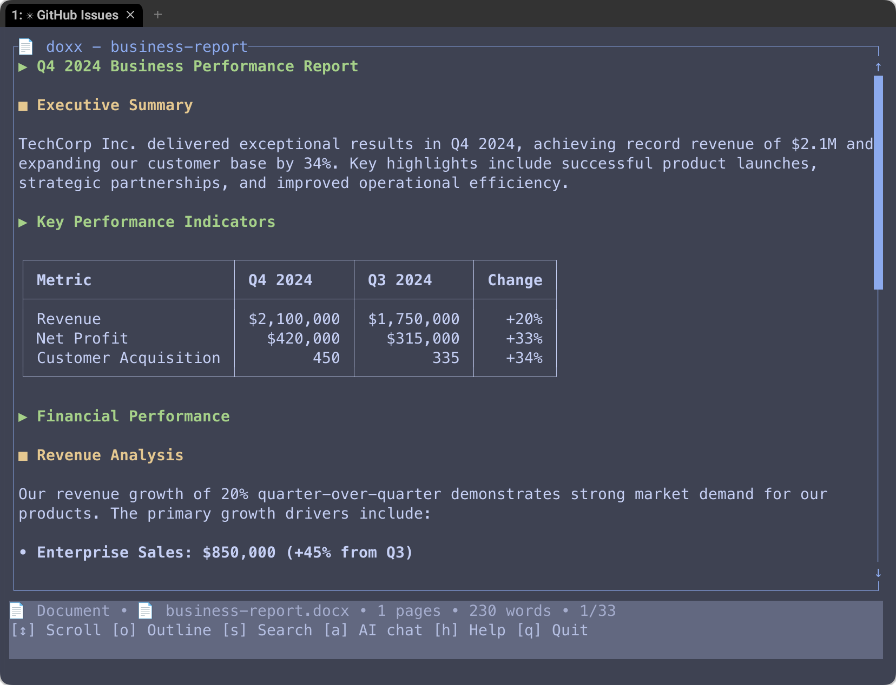

# doxx 📄

> Expose `.docx` files in your terminal — no Microsoft Word required

[](https://github.com/bgreenwell/doxx/actions/workflows/ci.yml)
[](https://opensource.org/licenses/MIT)
[](https://www.rust-lang.org/)

> **🚧 Under Active Development**: New features and improvements are being added regularly. Check back often for updates!

**doxx** is a lightning-fast, terminal-native document viewer for Microsoft Word files. Built with Rust for performance and reliability, it brings Word documents to your command line with beautiful rendering, smart table support, and powerful export capabilities.



## ✨ Features

### Document viewing
- 🎨 **Beautiful terminal rendering** with syntax highlighting and formatting
- 📊 **Professional table display** with smart alignment and Unicode borders
- 📋 **Nested list support** with proper indentation and multi-level hierarchy
- 🔍 **Full-text search** with highlighting and context
- 📑 **Document outline** for quick navigation
- 🎯 **Multiple view modes** — document, outline, search, and help

### Smart table support
- 📋 **Advanced table parsing** with automatic header detection
- 🎯 **Intelligent alignment** — numbers right-aligned, text left-aligned, booleans centered  
- 💱 **Data type detection** for currency, percentages, dates, and more
- 🎨 **Professional ASCII rendering** with scalable Unicode borders
- 🔄 **Search within tables** across headers and cell content

### Copy & clipboard
- 📋 **Copy to clipboard** - Copy rendered content directly from the terminal UI
- 🎯 **Context-aware copying** - Different content based on current view:
  - **Document view**: Copy full formatted document with headings, lists, and tables
  - **Outline view**: Copy document structure with indented headings
  - **Search view**: Copy search results with context
- 🖥️ **Cross-platform**: Works on Windows, macOS, and Linux (X11/Wayland)
- ✅ **Visual feedback** with status messages and error handling

### Export & integration
- 📝 **Markdown export** with proper table alignment indicators
- 📊 **CSV extraction** for data analysis workflows
- 📄 **Plain text** output for piping to other tools
- 🗂️ **JSON export** with full document structure
- ⚡ **CLI-friendly** for scripts and automation

## 🚀 Quick start

### Installation

```bash
# Install from source (requires Rust)
git clone https://github.com/bgreenwell/doxx.git
cd doxx
cargo install --path .
```

### Basic usage

```bash
# View a document
doxx quarterly-report.docx

# Start with outline view
doxx document.docx --outline

# Search for specific content
doxx contract.docx --search "payment terms"

# Export to different formats
doxx spreadsheet.docx --export csv > data.csv
doxx report.docx --export markdown > report.md
doxx document.docx --export json > structure.json

# Force interactive UI (useful for development/testing)
doxx document.docx --force-ui

# Get help
doxx --help
```

## 🎮 Terminal UI

Navigate documents with intuitive keyboard shortcuts and mouse support:

| Input | Action |
|-------|--------|
| `↑`/`k` or mouse wheel up | Scroll up |
| `↓`/`j` or mouse wheel down | Scroll down |
| `Page Up`/`Page Down` | Page navigation |
| `Home`/`End` | Jump to start/end |
| `o` | Toggle outline view |
| `s` | Open search |
| `c` | **Copy content to clipboard** |
| `F2` | Copy content (in search view) |
| `n`/`p` | Next/previous search result |
| `h`/`F1` | Toggle help |
| `q` | Quit |

## 💻 Examples

### Document analysis
```bash
# Quick document overview
doxx annual-report.docx

# Find all tables and export as CSV
doxx financial-data.docx --export csv

# Search for specific terms with context
doxx legal-contract.docx --search "liability"

# Navigate large documents with outline
doxx technical-manual.docx --outline
```

### Copy & clipboard workflow
```bash
# Interactive document review with copy
doxx quarterly-report.docx
# Navigate to important section, press 'c' to copy to clipboard
# Paste into email, Slack, or other applications

# Copy search results for sharing
doxx meeting-notes.docx --search "action items"
# Press F2 to copy all search results with context

# Copy document structure for planning
doxx technical-spec.docx --outline
# Press 'c' to copy hierarchical outline
```

### Pipeline integration
```bash
# Extract text for further processing
doxx meeting-notes.docx --export text | grep "action items"

# Convert Word tables to CSV for analysis
doxx survey-results.docx --export csv | python analyze.py

# Get document metadata as JSON
doxx report.docx --export json | jq '.metadata'
```

## 🏗️ Architecture

Built with modern Rust for maximum performance:

- **Document parsing**: [`docx-rs`](https://crates.io/crates/docx-rs) for robust `.docx` file handling
- **Terminal UI**: [`ratatui`](https://crates.io/crates/ratatui) for beautiful cross-platform interfaces  
- **Text processing**: [`unicode-segmentation`](https://crates.io/crates/unicode-segmentation) for proper Unicode support
- **Search**: [`regex`](https://crates.io/crates/regex) for powerful pattern matching

## 🎯 Why doxx?

**doxx fills a critical gap**: there's no good way to view Word documents in the terminal. Current solutions force you to choose between losing all formatting or switching to GUI applications.

### The Problem with Existing Tools

| Tool | Type | DOCX Support | Formatting | Tables | Interactive |
|------|------|-------------|------------|---------|------------|
| **docx2txt** | Text extractor | ✅ Basic | ❌ Lost | ❌ Mangled | ❌ No |
| **antiword** | Legacy converter | ❌ .doc only | ❌ Lost | ❌ Basic | ❌ No |
| **pandoc** | Universal converter | ✅ Via chain | ❌ Lost | ❌ Basic | ❌ No |
| **glow** | Markdown viewer | ❌ Wrong format | ✅ Rich | ✅ Good | ✅ Yes |
| **Microsoft Word** | GUI application | ✅ Native | ✅ Rich | ✅ Perfect | ✅ Yes |

### What doxx Brings

**doxx** is the **first terminal-native DOCX viewer** that preserves formatting and provides an interactive experience:

| Feature | doxx | Best Alternative |
|---------|------|------------------|
| **Rich DOCX viewing** | ✅ Native with formatting | ❌ Plain text only |
| **Smart table rendering** | ✅ Aligned with borders | ❌ Unformatted text |
| **Interactive navigation** | ✅ Full TUI interface | ❌ Pipe to `less` |
| **Terminal integration** | ✅ SSH-friendly, scriptable | ❌ GUI required |
| **Multiple exports** | ✅ Markdown, CSV, JSON | ❌ Text only |

### vs. Microsoft Word
- ⚡ **Instant startup** (50ms vs 8+ seconds)
- 💾 **Minimal memory** (15MB vs 500MB+ RAM)
- 💰 **Zero licensing costs** ($0 vs $149+ per license)
- 🔒 **SSH-friendly** for remote server access
- 🔧 **Scriptable** for automation workflows

### vs. Text Extractors (docx2txt, antiword)
- 🎨 **Preserves formatting** (bold, italic, structure)
- 📊 **Intelligent table rendering** with proper alignment
- 🖥️ **Interactive interface** vs. static text output
- 🔍 **Built-in search** with highlighting and navigation
- 📤 **Smart exports** with format-aware output

### vs. Terminal Document Viewers (glow, bat, mdcat)
- 📄 **Native DOCX support** vs. markdown/code only
- 🏢 **Business document focused** vs. developer files
- 📊 **Advanced table intelligence** for spreadsheet-like data
- 🔄 **Multiple export formats** for downstream processing

## 🛠️ Development

### Building from source

```bash
# Clone the repository
git clone https://github.com/bgreenwell/doxx.git
cd doxx

# Build and run
cargo build --release
cargo run -- --help

# Run tests
cargo test
```

### Project structure

```
src/
├── main.rs      # CLI argument parsing and entry point
├── document.rs  # Document parsing and table structures  
├── ui.rs        # Terminal interface and rendering
├── export.rs    # Export functionality for different formats
└── ai.rs        # AI integration framework (coming soon)
```

## 🚧 Roadmap

### Coming soon
- 🤖 **AI integration** for document summarization and Q&A
- 🔗 **Hyperlink support** for navigation within documents  
- 📷 **Image descriptions** with AI-generated alt text
- 🎨 **Themes and customization** for personalized viewing
- 🌐 **Web interface** for browser-based viewing

### AI-powered features (planned)
- 📝 **Document summarization** with key points extraction
- ❓ **Interactive Q&A** about document content
- 📊 **Smart data extraction** for action items and deadlines
- 🔍 **Semantic search** beyond keyword matching
- 🛡️ **Privacy-first** with local AI model support

## 🤝 Contributing

Contributions are welcome! Please feel free to submit a pull request or open an issue.

1. **Fork the repository**
2. **Create a feature branch** (`git checkout -b feature/amazing-feature`)
3. **Commit your changes** (`git commit -m 'Add amazing feature'`)
4. **Push to the branch** (`git push origin feature/amazing-feature`)
5. **Open a pull request**

## 📄 License

This project is licensed under the MIT License — see the [LICENSE](LICENSE) file for details.

## 🙏 Acknowledgments

- Built with the amazing [Rust](https://www.rust-lang.org/) programming language
- Terminal UI powered by [ratatui](https://ratatui.rs/)
- Document parsing with [docx-rs](https://crates.io/crates/docx-rs)
- Inspired by [Charm's Glow](https://github.com/charmbracelet/glow) for beautiful CLI rendering
- Influenced by the terminal-first development philosophy

---

**Made with ❤️ for developers who live in the terminal**