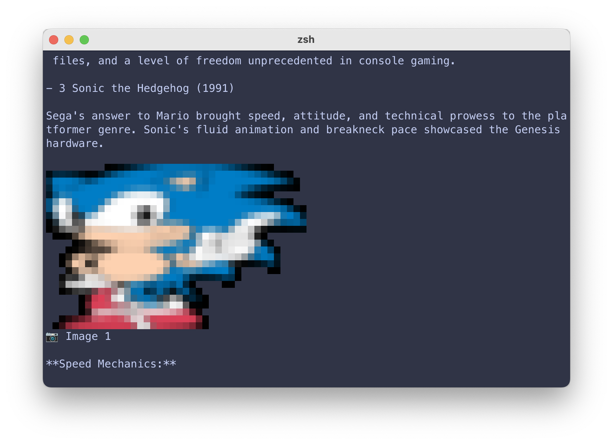
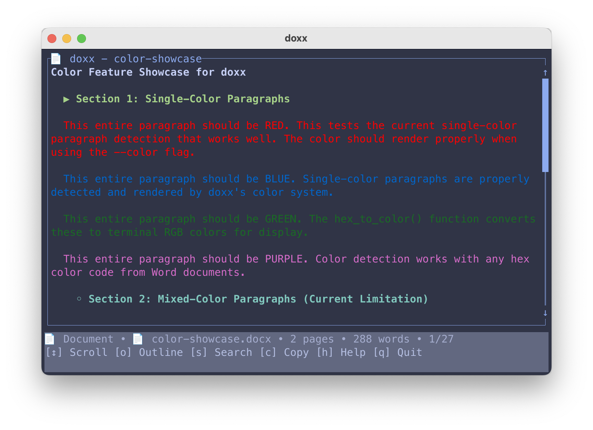
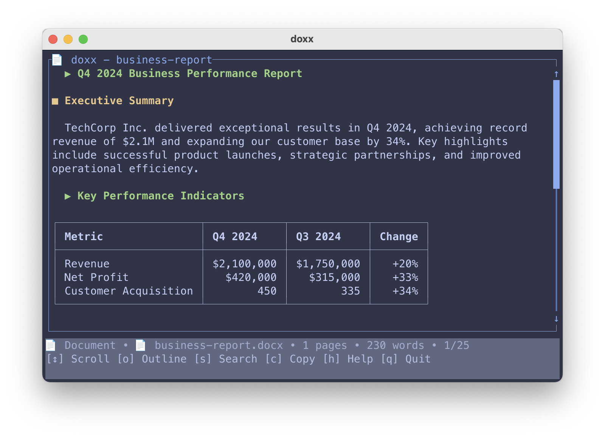
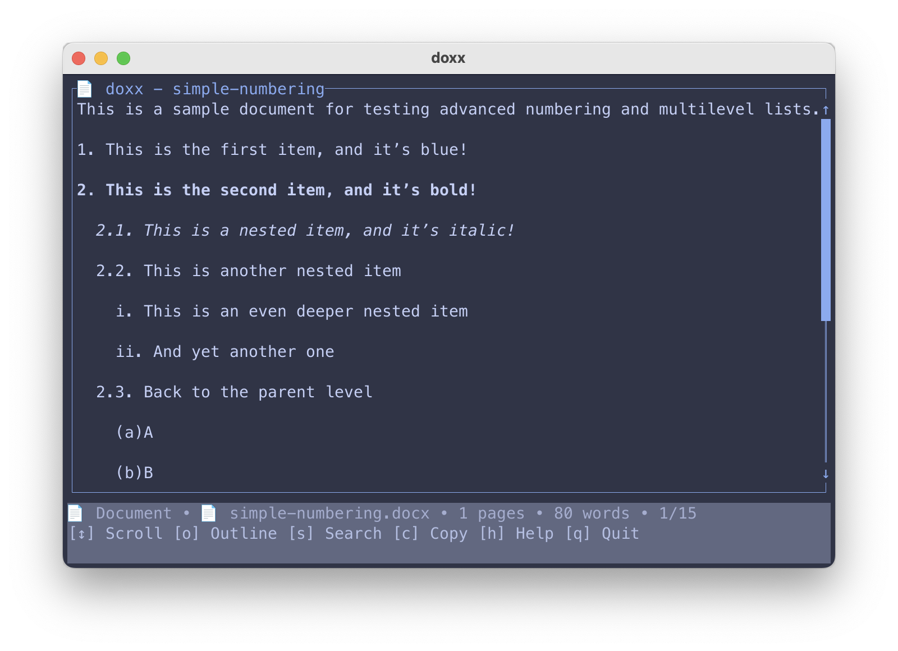

# doxx 📄

> `.docx` files in your terminal — no Microsoft Word required

[](https://github.com/bgreenwell/doxx/actions/workflows/ci.yml)
[](https://opensource.org/licenses/MIT)
[](https://www.rust-lang.org/)

A fast, terminal-native document viewer for Word files. View, search, and export `.docx` documents without leaving your command line.

## Screenshots

<div align="center">
  <table>
    <tr>
      <td align="center">
        
        <br><em>Terminal image display</em>
      </td>
      <td align="center">
        
        <br><em>Color support</em>
      </td>
    </tr>
    <tr>
      <td align="center">
        
        <br><em>Smart tables with alignment</em>
      </td>
      <td align="center">
        
        <br><em>Lists and formatting</em>
      </td>
    </tr>
  </table>
</div>

## ✨ Features

- **Beautiful terminal rendering** with formatting, tables, and lists
- **Fast search** with highlighting 🔍
- **Smart tables** with proper alignment and Unicode borders
- **Copy to clipboard** — grab content directly from the terminal
- **Export formats** — Markdown, CSV, JSON, plain text
- **Terminal images** for Kitty, iTerm2, WezTerm 🖼️
- **Color support** — see Word document colors in your terminal

## 🚀 Installation

### Pre-built binaries

Download from [GitHub releases](https://github.com/bgreenwell/doxx/releases):

```bash
# macOS/Linux
curl -L https://github.com/bgreenwell/doxx/releases/latest/download/doxx-$(uname -s)-$(uname -m).tar.gz | tar xz
sudo mv doxx /usr/local/bin/

# Verify
doxx --version
```

### Build from source

```bash
git clone https://github.com/bgreenwell/doxx.git
cd doxx
cargo install --path .
```

## 🎯 Usage

```bash
# View a document
doxx report.docx

# Search for content
doxx contract.docx --search "payment"

# Start with outline view
doxx document.docx --outline

# Export to different formats
doxx data.docx --export csv > data.csv
doxx report.docx --export markdown > report.md

# View with images (supported terminals)
doxx presentation.docx --images --export text

# Enable color rendering
doxx slides.docx --color
```

## ⌨️ Navigation

| Key | Action |
|-----|--------|
| `↑`/`k` | Scroll up |
| `↓`/`j` | Scroll down |
| `o` | Toggle outline |
| `s` | Search |
| `c` | Copy to clipboard |
| `h` | Help |
| `q` | Quit |

## 🔧 Why doxx?

Current terminal tools for Word documents:
- **docx2txt** → Loses all formatting, mangled tables
- **pandoc** → Complex chain, formatting lost
- **antiword** → Only handles old `.doc` files

**doxx** gives you:
- ✅ Rich formatting preserved (bold, italic, headers)
- ✅ Professional table rendering with alignment
- ✅ Interactive navigation and search
- ✅ Multiple export formats for workflows
- ✅ Terminal image display for modern terminals
- ✅ Fast startup (50ms vs Word's 8+ seconds)

Perfect for developers, sysadmins, and anyone who prefers the terminal.

## 📊 Examples

### Quick document analysis
```bash
# Get overview and search
doxx quarterly-report.docx
doxx --search "revenue"

# Extract tables for analysis
doxx financial-data.docx --export csv | python analyze.py
```

### Copy workflows
```bash
# Review and copy sections
doxx meeting-notes.docx
# Press 'c' to copy current view to clipboard

# Copy search results
doxx specs.docx --search "requirements"
# Press F2 to copy results with context
```

### Pipeline integration
```bash
# Extract text for processing
doxx notes.docx --export text | grep "action items"

# Get document structure
doxx report.docx --export json | jq '.metadata'
```

## 🏗️ Architecture

Built with Rust for performance:
- **[docx-rs](https://crates.io/crates/docx-rs)** — Document parsing
- **[ratatui](https://crates.io/crates/ratatui)** — Terminal UI
- **[viuer](https://crates.io/crates/viuer)** — Image rendering
- **[unicode-segmentation](https://crates.io/crates/unicode-segmentation)** — Proper Unicode handling

## 🛠️ Development

```bash
# Build and test
cargo build --release
cargo test

# Run with sample document
cargo run -- tests/fixtures/sample.docx
```

## 📋 Roadmap

- Enhanced table support (merged cells, complex layouts)
- Performance improvements for large documents
- Hyperlink navigation
- Custom themes

## 📝 License

MIT License — see [LICENSE](LICENSE) file for details.

---

**Made for developers who live in the terminal** 🚀